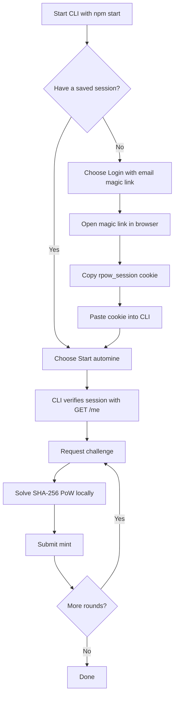

# RPOW2 CLI

A small, friendly CLI for mining RPOW2 from your terminal.

It uses the normal RPOW2 login flow, saves your session cookie locally, gets a proof-of-work challenge, solves it on your machine, then submits the mint.

No browser hacks. No email/password scraping. Just the official challenge -> solve -> mint loop.

## What you get

- Email magic-link login helper.
- Saved local session via `.rpow2-session.json`.
- One-shot or infinite automine mode.
- CPU worker control for faster local solving.
- Balance checker.
- Public ledger viewer.
- Network timeout + retry handling.
- Clean terminal UI.

## Quick start

```bash
git clone https://github.com/exd77/rpow2-cli.git
cd rpow2-cli
npm install
npm start
```

That's it. The app opens a menu and walks you through the rest.

## Requirements

- Node.js 22 or newer
- npm
- A valid RPOW2 account/session

Check your Node version:

```bash
node -v
```

If it is below `v22`, upgrade Node first.

## Terminal output

When you run:

```bash
npm start
```

You should see something like this:

```text
> rpow2-automine-cli@0.1.0 start
> node src/cli.js

Loaded session: rpow_session=abc123...xyz789

██████╗ ██████╗  ██████╗ ██╗    ██╗██████╗     ███╗   ███╗██╗███╗   ██╗███████╗
██╔══██╗██╔══██╗██╔═══██╗██║    ██║╚════██╗    ████╗ ████║██║████╗  ██║██╔════╝
██████╔╝██████╔╝██║   ██║██║ █╗ ██║ █████╔╝    ██╔████╔██║██║██╔██╗ ██║█████╗
██╔══██╗██╔═══╝ ██║   ██║██║███╗██║██╔═══╝     ██║╚██╔╝██║██║██║╚██╗██║██╔══╝
██║  ██║██║     ╚██████╔╝╚███╔███╔╝███████╗    ██║ ╚═╝ ██║██║██║ ╚████║███████╗
╚═╝  ╚═╝╚═╝      ╚═════╝  ╚══╝╚══╝ ╚══════╝    ╚═╝     ╚═╝╚═╝╚═╝  ╚═══╝╚══════╝                              

[1] Login with email magic link
[2] Start automine
[3] Check balance
[4] View public ledger
[5] Show saved session
[0] Exit

Choose an option:
```

If you do not have a saved session yet, the `Loaded session` line will not appear. That's normal.

## Simple setup flow

### 1. Install

```bash
git clone https://github.com/exd77/rpow2-cli.git
cd rpow2-cli
npm install
```

### 2. Start the CLI

```bash
npm start
```

### 3. Login once

Choose:

```text
[1] Login with email magic link
```

Then:

1. Enter your RPOW2 email.
2. Open the magic link in your browser.
3. Open browser DevTools.
4. Go to Application/Storage -> Cookies.
5. Find `rpow_session` for `rpow2.com` or `api.rpow2.com`.
6. Paste the cookie value or full Cookie header back into the CLI.

The CLI saves it locally here:

```text
.rpow2-session.json
```

That file is ignored by git. Keep it private.

### 4. Start mining

Choose:

```text
[2] Start automine
```

Example beginner-safe settings:

```text
How many RPOW should we mine? Leave blank for infinite: 1
CPU workers? Leave blank for 2: 1
```

For infinite mining:

```text
How many RPOW should we mine? Leave blank for infinite:
CPU workers? Leave blank for 2: 2
```

Stop anytime with:

```text
Ctrl+C
```

## Worker guide

Use roughly one worker per vCPU.

- 1 vCPU -> `1` worker
- 2 vCPU -> `1-2` workers
- 4 vCPU -> `2-4` workers
- 8 vCPU -> `4-8` workers

On Linux, check your CPU count with:

```bash
nproc
```

If the machine feels laggy, lower the worker count.

## Workflow



## What the miner does

For every round, the CLI:

1. Verifies your session with `GET /me`.
2. Requests a challenge from RPOW2.
3. Solves the proof-of-work locally:

   ```text
   sha256(nonce_prefix || uint64_le(solution_nonce))
   ```

4. Checks that the hash has enough trailing zero bits.
5. Submits the valid nonce to mint RPOW.

## Optional: run with an environment cookie

If you do not want to save `.rpow2-session.json`, run:

```bash
RPOW_COOKIE='rpow_session=...' npm start
```

## Useful commands

Run tests:

```bash
npm test
```

Check the current saved session from the menu:

```text
[5] Show saved session
```

Check your balance:

```text
[3] Check balance
```

View public ledger stats:

```text
[4] View public ledger
```

## Troubleshooting

### Magic link request fails

If the error mentions Resend or an API key, that is an upstream RPOW2 email-provider issue. Try logging in from the website, or paste an existing browser cookie manually.

### `fetch failed`, `ETIMEDOUT`, or `ECONNRESET`

Usually network-related. Try:

- Check server internet/DNS.
- Try again later.
- Lower CPU workers.
- Test the ledger endpoint from the server.

### Session expired

Login again and replace the saved `rpow_session` cookie.

### Mining is slow

- Use more workers if you have spare vCPU.
- Make sure you are not running multiple miners by accident.
- Lower workers if CPU is overloaded.

## Safety notes

- Do not commit `.rpow2-session.json`.
- Do not share `rpow_session`.
- Do not hardcode cookies in source files.
- Use the official RPOW2 login flow.
